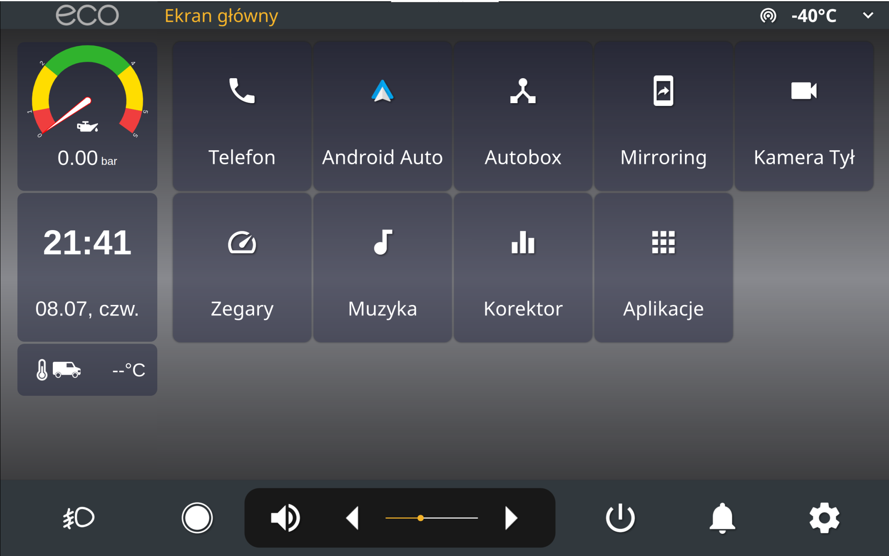
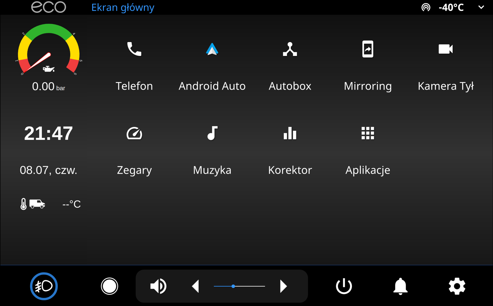

# openauto-helper

Simple app displayed on the same screen, adjacent to [OpenAuto Pro](https://bluewavestudio.io/shop/openauto-pro-car-head-unit-solution/). It's using Electron framework with React library, and it's using less resources than I imagined it would. It's main purpose is taking control for some of the car features (steering fog lights, displaying oil pressure etc.).

## How it's done

For splitting one screen for two fullscreen apps, I'm using [fakexrandr](https://github.com/phillipberndt/fakexrandr) library that creates virtual displays. It's not working perfectly but it suffices (it's pretty old and quite a hassle to install on the pi). Also I have tweaked few openbox settings for proper app placement.
The layout of the UI was adjusted by pixels to match the OpenAuto's look (it's not pixel perfect but I'm fine with it).
**The default settings are targeted for 2560x1600px display and 452px side bar width.**

## Configuration

### The app is strongly custom for my use, although I designed it to be decently modular, so it'd be possible to adjust it for other setup.

The electron side of the app can be tweaked in [config.ts](/electron/config.ts) file. It contains settings related to I/O and appearance.
For the front-end side, there is a [config.scss](/src/config.scss) containg most of the app's styling information. For tweaking components you'll need to dive into [jsx components](/src/components).

## Appearance

The app is always monitoring OpenAuto's config file and uppon change, it is updating it's appearance as well (for the most part). In case of any problem, app will refer to fallback values written in electron's config file.

## Building

To build the app, you'll need **nodejs** (version 10.24.0 works alright), **yarn** (or npm) and about 1GB for node_modules(smh).

    git clone https://github.com/b0czek/openauto-helper # clone the repository
    cd openauto-helper

    yarn # install dependencies
    yarn build # build executable

After that in dist directory, there should be `openauto-helper.AppImage` executable.
If you want the app to start automatically, add it's path at the begging of `/etc/xdg/lxsession/LXDE-pi/autostart` file.
